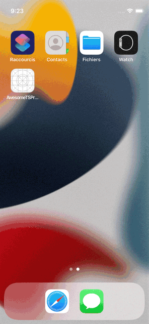

How to run it in iOS simulator ?

1. install packages

```sh
npm i
cd ios && pod install
```

2. Open and build it in xcode and run it on iOS simulator



Show Ads in React Native App

click ads to open it in browser
